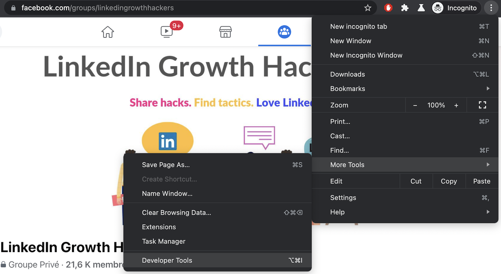
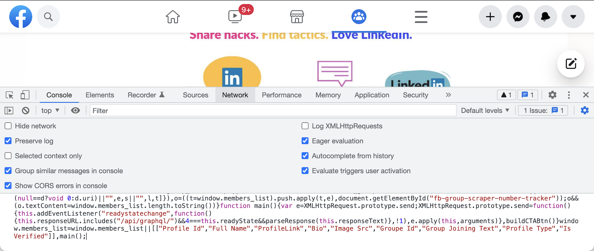
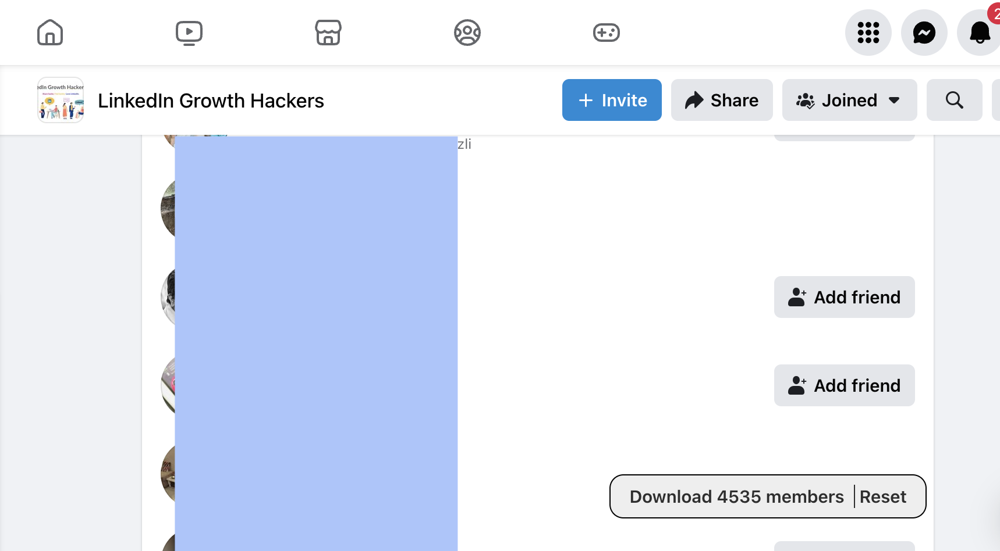
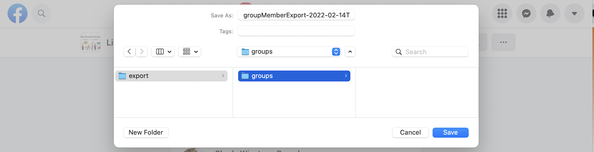

# Facebook Group Members Scraper

Script to scrape Facebook group members and export them into a CSV file. This Facebook Group members extractor works in the browser, without installing an extension or using a proxy. Just copy-paste the script into your Chrome console.

## How to run the Facebook Group Extractor script

 1. Go to a Facebook group page
 1. Open Chrome Developer Console
 1. Copy Paste the following code into the console. It will add a "Download 0 members" button
 1. Click on the "People" tab of the group page
 1. Scroll to load new members that will get caught by the script. The button counter increases with new members scraped.
 1. Once done, click on the "Download X members" button to download the generated CSV file
 1. The profiles are kept in a cache until you click the "Reset" button. Thanks to this cache, the extracted profiles are still available if your browser "crash"

 Read our step-by-step [guide to extract Facebook group members and find their LinkedIn profile](https://www.datablist.com/how-to/scrape-facebook-group-members-linkedin)

> [dist/main.min.js](dist/main.min.js)

```javascript
var X=Object.defineProperty,Y=(e,t,n)=>t in e?X(e,t,{enumerable:!0,configurable:!0,writable:!0,value:n}):e[t]=n,k=(e,t,n)=>(Y(e,"symbol"!=typeof t?t+"":t,n),n);function Z(e,t){for(var n="",r=0;r<t.length;r++)n+=function(e){for(var t="",n=0;n<e.length;n++){var r=null===e[n]||"u"<typeof e[n]?"":e[n].toString(),r=(r=e[n]instanceof Date?e[n].toLocaleString():r).replace(/"/g,'""');0<n&&(t+=","),t+=r=0<=r.search(/("|,|\n)/g)?'"'+r+'"':r}return t+`
`}(t[r]);var o=new Blob([n],{type:"text/csv;charset=utf-8;"}),i=document.createElement("a");void 0!==i.download&&(o=URL.createObjectURL(o),i.setAttribute("href",o),i.setAttribute("download",e),document.body.appendChild(i),i.click(),document.body.removeChild(i))}const E=(t,e)=>e.some(e=>t instanceof e);let M,j;function N(){return M=M||[IDBDatabase,IDBObjectStore,IDBIndex,IDBCursor,IDBTransaction]}function G(){return j=j||[IDBCursor.prototype.advance,IDBCursor.prototype.continue,IDBCursor.prototype.continuePrimaryKey]}const _=new WeakMap,x=new WeakMap,m=new WeakMap;function Q(i){var e=new Promise((e,t)=>{const n=()=>{i.removeEventListener("success",r),i.removeEventListener("error",o)},r=()=>{e(h(i.result)),n()},o=()=>{t(i.error),n()};i.addEventListener("success",r),i.addEventListener("error",o)});return m.set(e,i),e}function ee(i){var e;_.has(i)||(e=new Promise((e,t)=>{const n=()=>{i.removeEventListener("complete",r),i.removeEventListener("error",o),i.removeEventListener("abort",o)},r=()=>{e(),n()},o=()=>{t(i.error||new DOMException("AbortError","AbortError")),n()};i.addEventListener("complete",r),i.addEventListener("error",o),i.addEventListener("abort",o)}),_.set(i,e))}let D={get(e,t,n){if(e instanceof IDBTransaction){if("done"===t)return _.get(e);if("store"===t)return n.objectStoreNames[1]?void 0:n.objectStore(n.objectStoreNames[0])}return h(e[t])},set(e,t,n){return e[t]=n,!0},has(e,t){return e instanceof IDBTransaction&&("done"===t||"store"===t)||t in e}};function K(e){D=e(D)}function te(t){return G().includes(t)?function(...e){return t.apply(C(this),e),h(this.request)}:function(...e){return h(t.apply(C(this),e))}}function ne(e){return"function"==typeof e?te(e):(e instanceof IDBTransaction&&ee(e),E(e,N())?new Proxy(e,D):e)}function h(e){if(e instanceof IDBRequest)return Q(e);if(x.has(e))return x.get(e);var t=ne(e);return t!==e&&(x.set(e,t),m.set(t,e)),t}const C=e=>m.get(e);function re(e,t,{blocked:n,upgrade:r,blocking:o,terminated:i}={}){const s=indexedDB.open(e,t),a=h(s);return r&&s.addEventListener("upgradeneeded",e=>{r(h(s.result),e.oldVersion,e.newVersion,h(s.transaction),e)}),n&&s.addEventListener("blocked",e=>n(e.oldVersion,e.newVersion,e)),a.then(e=>{i&&e.addEventListener("close",()=>i()),o&&e.addEventListener("versionchange",e=>o(e.oldVersion,e.newVersion,e))}).catch(()=>{}),a}const ie=["get","getKey","getAll","getAllKeys","count"],se=["put","add","delete","clear"],I=new Map;function L(e,t){if(e instanceof IDBDatabase&&!(t in e)&&"string"==typeof t){if(I.get(t))return I.get(t);const r=t.replace(/FromIndex$/,""),o=t!==r,i=se.includes(r);return r in(o?IDBIndex:IDBObjectStore).prototype&&(i||ie.includes(r))?(e=async function(e,...t){e=this.transaction(e,i?"readwrite":"readonly");let n=e.store;return o&&(n=n.index(t.shift())),(await Promise.all([n[r](...t),i&&e.done]))[0]},I.set(t,e),e):void 0}}K(r=>({...r,get:(e,t,n)=>L(e,t)||r.get(e,t,n),has:(e,t)=>!!L(e,t)||r.has(e,t)}));const oe=["continue","continuePrimaryKey","advance"],R={},S=new WeakMap,W=new WeakMap,ae={get(e,t){if(!oe.includes(t))return e[t];let n=R[t];return n=n||(R[t]=function(...e){S.set(this,W.get(this)[t](...e))})}};async function*ce(...e){let t=this;if(t=t instanceof IDBCursor?t:await t.openCursor(...e)){t=t;var n=new Proxy(t,ae);for(W.set(n,t),m.set(n,C(t));t;)yield n,t=await(S.get(n)||t.continue()),S.delete(n)}}function V(e,t){return t===Symbol.asyncIterator&&E(e,[IDBIndex,IDBObjectStore,IDBCursor])||"iterate"===t&&E(e,[IDBIndex,IDBObjectStore])}K(r=>({...r,get(e,t,n){return V(e,t)?ce:r.get(e,t,n)},has(e,t){return V(e,t)||r.has(e,t)}}));var f=function(e,s,a,d){return new(a=a||Promise)(function(n,t){function r(e){try{i(d.next(e))}catch(e){t(e)}}function o(e){try{i(d.throw(e))}catch(e){t(e)}}function i(e){var t;e.done?n(e.value):((t=e.value)instanceof a?t:new a(function(e){e(t)})).then(r,o)}i((d=d.apply(e,s||[])).next())})},de=function(e,t){var n={};for(o in e)Object.prototype.hasOwnProperty.call(e,o)&&t.indexOf(o)<0&&(n[o]=e[o]);if(null!=e&&"function"==typeof Object.getOwnPropertySymbols)for(var r=0,o=Object.getOwnPropertySymbols(e);r<o.length;r++)t.indexOf(o[r])<0&&Object.prototype.propertyIsEnumerable.call(e,o[r])&&(n[o[r]]=e[o[r]]);return n};class ue{constructor(e){this.name="scrape-storage",this.persistent=!0,this.data=new Map,null!=e&&e.name&&(this.name=e.name),null!=e&&e.persistent&&(this.persistent=e.persistent),this.initDB().then(()=>{}).catch(()=>{this.persistent=!1})}get storageKey(){return"storage-"+this.name}initDB(){return f(this,void 0,void 0,function*(){this.db=yield re(this.storageKey,5,{upgrade(e,t,n,r){let o;t<5&&e.deleteObjectStore("data"),(o=e.objectStoreNames.contains("data")?r.objectStore("data"):e.createObjectStore("data",{keyPath:"_id",autoIncrement:!0}))&&!o.indexNames.contains("_createdAt")&&o.createIndex("_createdAt","_createdAt"),o&&!o.indexNames.contains("_pk")&&o.createIndex("_pk","_pk",{unique:!0})}})})}_dbAddElem(t,n,r){return f(this,void 0,void 0,function*(){if(!this.persistent||!this.db)throw new Error("DB doesnt exist");{const e=(r=r||this.db.transaction("data","readwrite")).store;(yield e.index("_pk").get(t))||(yield e.put(Object.assign({_pk:t,_createdAt:new Date},n)))}})}addElem(e,t){return f(this,void 0,void 0,function*(){if(this.persistent&&this.db)try{yield this._dbAddElem(e,t)}catch(e){console.error(e)}else this.data.set(e,t)})}addElems(e){return f(this,void 0,void 0,function*(){if(this.persistent&&this.db){const n=[],r=this.db.transaction("data","readwrite");e.forEach(([e,t])=>{n.push(this._dbAddElem(e,t,r))}),n.push(r.done),yield Promise.all(n)}else e.forEach(([e,t])=>{this.addElem(e,t)})})}clear(){return f(this,void 0,void 0,function*(){this.persistent&&this.db?yield this.db.clear("data"):this.data.clear()})}getCount(){return f(this,void 0,void 0,function*(){return this.persistent&&this.db?yield this.db.count("data"):this.data.size})}getAll(){return f(this,void 0,void 0,function*(){if(this.persistent&&this.db){const n=new Map,e=yield this.db.getAll("data");return e&&e.forEach(e=>{var t=e["_id"],e=de(e,["_id"]);n.set(t,e)}),n}return this.data})}toCsvData(){return f(this,void 0,void 0,function*(){const t=[];return t.push(this.headers),(yield this.getAll()).forEach(e=>{try{t.push(this.itemToRow(e))}catch(e){console.error(e)}}),t})}}function y(e,t){const n=document.createElement("span");return t&&n.setAttribute("id",t),n.textContent=e,n}function F(e){const t=document.createElement("div"),n=["display: block;","padding: 0px 4px;"];return e&&n.push("border-left: 1px solid #2e2e2e;","margin-left: 4px;"),t.setAttribute("style",n.join("")),t}function le(){const e=document.createElement("div");return e.setAttribute("style",["position: absolute;","bottom: 30px;","right: 130px;","color: #2e2e2e;","background: #EEE;","border-radius: 12px;","padding: 0px 12px;","cursor: pointer;","font-weight:600;","font-size:15px;","display: flex;","pointer-events: auto;","border: 1px solid #000;","height: 36px;","align-items: center;","justify-content: center;"].join("")),e}function fe(){const e=document.createElement("div");e.setAttribute("style",["position: fixed;","top: 0;","left: 0;","z-index: 10;","width: 100%;","height: 100%;","pointer-events: none;"].join(""));var t=le();return e.appendChild(t),document.body.appendChild(e),t}class he extends ue{constructor(){super(...arguments),k(this,"name","fb-scrape-storage")}get headers(){return["Profile Id","Full Name","Profile Link","Bio","ImageSrc","GroupId","Group Joining Text","Profile Type"]}itemToRow(e){return[e.profileId,e.fullName,e.profileLink,e.bio,e.imageSrc,e.groupId,e.groupJoiningText,e.profileType]}}const g=new he;async function B(){const e=document.getElementById("fb-group-scraper-number-tracker");if(e){const t=await g.getCount();e.textContent=t.toString()}}function pe(){const e=fe(),t=F(),n=(t.appendChild(y("Download ")),t.appendChild(y("0","fb-group-scraper-number-tracker")),t.appendChild(y(" members")),t.addEventListener("click",async function(){Z(`groupMemberExport-${(new Date).toISOString()}.csv`,await g.toCsvData())}),e.appendChild(t),F(!0));n.appendChild(y("Reset")),n.addEventListener("click",async function(){await g.clear(),await B()}),e.appendChild(n),window.setTimeout(()=>{B()},1e3)}function ye(e){var t;let n;if(null!=(t=null==e?void 0:e.data)&&t.group)n=e.data.group;else{if("Group"!==(null==(t=null==(t=null==e?void 0:e.data)?void 0:t.node)?void 0:t.__typename))return;n=e.data.node}let r;if(null!=(t=null==n?void 0:n.new_members)&&t.edges)r=n.new_members.edges;else if(null!=(e=null==n?void 0:n.new_forum_members)&&e.edges)r=n.new_forum_members.edges;else{if(null==(t=null==n?void 0:n.search_results)||!t.edges)return;r=n.search_results.edges}const o=r.map(e=>{var t="GroupUserInvite"===e.node.__isEntity?e.node.invitee_profile:e.node;if(!t)return null;var{id:n,name:r,bio_text:o,url:i,profile_picture:s,__isProfile:a}=t,d=(null==(d=null==e?void 0:e.join_status_text)?void 0:d.text)||(null==(e=null==(d=null==e?void 0:e.membership)?void 0:d.join_status_text)?void 0:e.text),t=null==(e=t.group_membership)?void 0:e.associated_group.id;return{profileId:n,fullName:r,profileLink:i,bio:(null==o?void 0:o.text)||"",imageSrc:(null==s?void 0:s.uri)||"",groupId:t,groupJoiningText:d||"",profileType:a}}),i=[];o.forEach(e=>{e&&i.push([e.profileId,e])}),g.addElems(i).then(()=>{B()})}function ge(e){let n=[];try{n.push(JSON.parse(e))}catch(t){var r=e.split(`
`);if(r.length<=1)return void console.error("Fail to parse API response",t);for(let e=0;e<r.length;e++){var o=r[e];try{n.push(JSON.parse(o))}catch{console.error("Fail to parse API response",t)}}}for(let e=0;e<n.length;e++)ye(n[e])}function me(){pe();let e=XMLHttpRequest.prototype.send;XMLHttpRequest.prototype.send=function(){this.addEventListener("readystatechange",function(){this.responseURL.includes("/api/graphql/")&&4===this.readyState&&ge(this.responseText)},!1),e.apply(this,arguments)}}me();
```


## Exported Fields

- **Profile Id**: Unique facebook identifier. Multi-digit number.
- **Full Name**: First name and last name concatenated.
- **Profile Link**: Profile URI in the format https://www.facebook.com/{{username}}. When not available, default to https://www.facebook.com/profile.php?id={{profile_id}}
- **Bio**: Profile bio text.
- **Image Src**: Profile picture URI.
- **Group Id**: Facebook group identifier. Multi-digit number.
- **Group Joining Text**: Relative time since user joined the group. In the format: "Member since XX".
- **Profile Type**: Facebook profile type. "User" or "Page".


## Group Members Extractor tutorial with screenshots

**Open Chrome Developer Console**

To open the Chrome Developer console on Chrome, use the keyboard shortcut `Ctrl + Shift + I` (on Windows) or `Cmd + Option + I` (on Mac).




**Copy Paste the script**

Select the "Console" tab and copy-paste the script from above. Facebook shows a warning message in the "Console" asking not to  paste a script from a non-trustworthy source. It's true! And if you don't trust this script, stop here. [Read the source code](main.ts) to understand what this script does.




**Click on the "People" tab and scroll to load new members**

In the Group Page, go to "People" and scroll to the bottom of the page. If the counter in the button text increases as your scroll, it's working!




**Export members in CSV format**

Once finished, or to perform "export checkpoints", click the button "Download X members". A Download window will prompt asking where to save your CSV file.




**Edit and view your CSV file**

[To load and view the CSV file](https://www.datablist.com/csv-editor), use [Datablist.com](https://www.datablist.com/) or any spreadsheet tools.


**Manage your Facebook leads and enrich them with LinkedIn Profile**

Use Facebook members profiles to build a leads database. Filter and segment leads to find the most relevant leads to contact. Then, enrich Facebook members with LinkedIn profile and email address.
Follow this step-by-step tutorial to [scrape Facebook members and find their LinkedIn profiles](https://www.datablist.com/how-to/scrape-facebook-group-members-linkedin)


## FAQ

- **How to remove the "Download" button?**
    - Just reload your Facebook page. Any javascript code added in Chrome Developer Console will be removed.
- **How many members can be extracted for one group?**
    - Facebook loads a maximum of 10k profiles in the "People" tab. We recommend extracting new members on a regular basis. And then, [consolidate all your Facebook profiles in a single list using Datablist.com](https://www.datablist.com/how-to/scrape-facebook-group-members-linkedin).
- **Can I extract members from different groups at one time?**
    - Yes. The exported CSV contains a "Group Id" attribute. Load members from one Facebook group, go to another group page (without reloading your page), load members, and click "Download". Members extracted from both groups will be in a single CSV file with different "Group Id" values.
- **What is the "Reset" button?**
    - The profiles are stored in a cache in your browser. The cache is kept if your browser restart the page (intentionally or after a crash). When you copy/paste the script, it loads the previous profiles from the cache. The "Reset" button clear the cache.


## How to build it locally

```
yarn install
yarn build
```


The generated script is located in `dist/main.min.js`.
